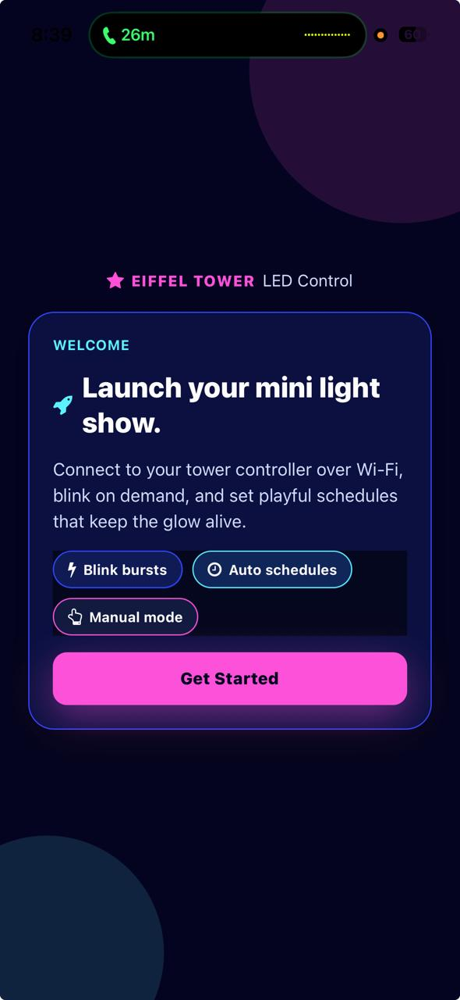
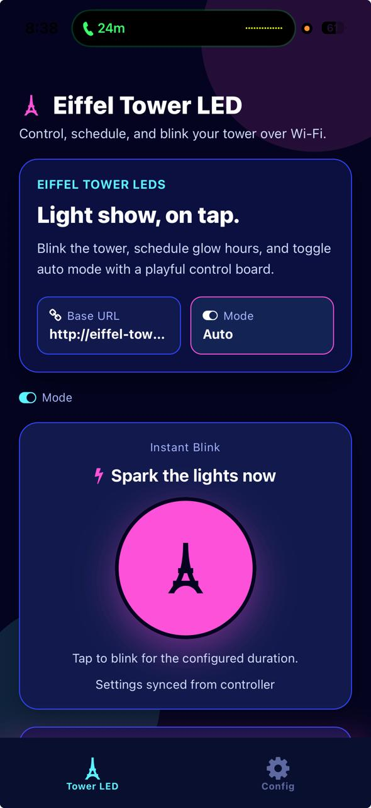
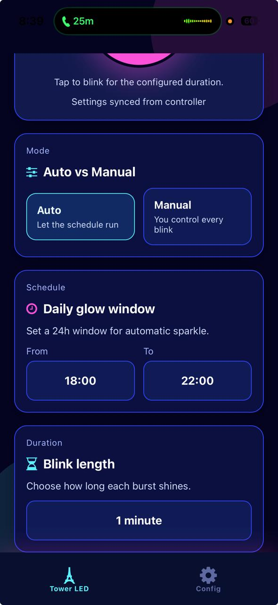
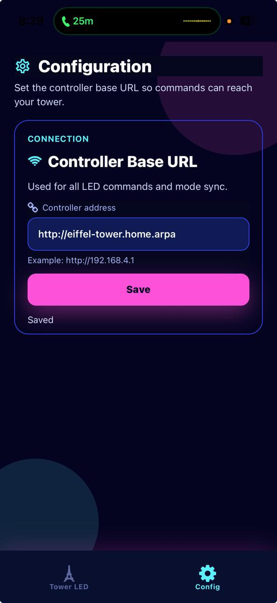

# Eiffel Tower LED

Goal of this project is experience Vibe-coding and also make my wife a little more happier.

This project is consist of two main components. Hardware and the App.

## The Hardware

Eiffel Tower souvenir was purchased during our Paris visit. 
It has a on-off switch and operates on 3-AA batteries.
Turning it on, sparkles multiple LEDs.

**Components:**

- [ESP32-C3 Supermini](https://de.aliexpress.com/item/1005007479144456.html)
- [1-Channel Relay](https://de.aliexpress.com/item/1005002983784189.html)

**[Circuit Diagram](https://app.cirkitdesigner.com/project/8b2d8786-043a-4003-bc49-5281fa629f37)**


**Firmware**

I use Arduino IDE in MacOS Tahoe (Intel) to write a firmware. It supports following feature:

- Turn on the relay to sparkle(the souvenir's built-in feature) Eiffel Tower every hour from 18:00 to 22:00 for 1-minute duration.
- It connects to wifi and sync time.
- Exposes HTTP server to configure duration, time range and mode (auto-manual) and trigger manual sparkle.

## The App (Vibe-coded)







This app is entirely Vibe-coded using GPT-5.1-Codex-Max in VS Code Copilot.

**Initial Setup**

- Since my entire workflow is around VS Code Web using Devcontainer and Coder, I use 
[react-native-expo-devcontainer](https://github.com/zketosis/react-native-expo-devcontainer-template) template.
- The template uses [Expo](https://expo.dev/) framework for react-native app development.

**Setup**

- Rename `.env.example` to `.env` and adjust the variable value.
If you've locally reachable http proxy server, then use `EXPO_PACKAGER_PROXY_URL` otherwise `REACT_NATIVE_PACKAGER_HOSTNAME` should be enough.

- Install Expo android/ios app your phone. 

- Run `npm start` and scan the QR code on your phone which should open the app inside Expo.

**Compile App for Android**

- Run `npm run build:android`

**Tips to Run on iOS**

Since we cannot sideload `IPA` files, we can host expo server and open the app from Expo app.

Instruction:

Export following variables

```
export CI=1
export EXPO_PACKAGER_PROXY_URL="https://your-public-url.example.com"
```

and run

`npx expo start --no-dev --minify --offline`

then open

`exp://your-public-url.example.com`

# Reference:

- https://stackoverflow.com/questions/49125697/host-expo-app-on-external-network
